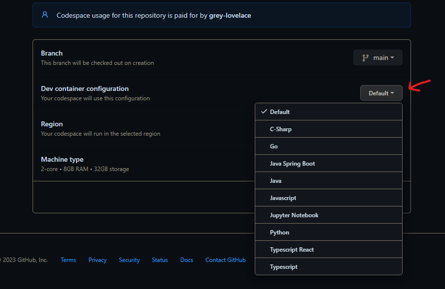
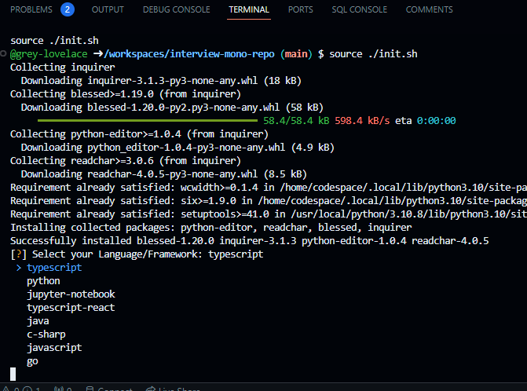

# Source Allies Interviews

This repository contains information about the Source Allies pairing session process.

Please see our [careers page](https://www.sourceallies.com/careers/) if you are interested in working on our team!

_This repo is part of an active effort to make our pairing session process more transparent. We are continuously improving our interview process to make it more effective._

## Typical Interview Process

Our pairing process typically consists of four steps:

1. Meeting You
2. Self Evalutation
3. A custom [HackerRank](https://www.hackerrank.com/) coding exercise
4. In-person (or virtual) technical pairing session 

## Meeting You

You’ll meet with a recruiter through a call, virtual hangout, or even a coffee. You will connect and talk about your background, where you would like to grow your career, and what drew you to Source Allies. This conversation is to gain an understanding of initial alignment for both parties.

## Self Evaluation

This document will be a chance for you to tell stories and share with Source Allies a more in-depth snapshot of your experience and perspectives. There will also be a confidential information component that is shared only between you and your recruiter. 

## Coding Exercise

This is an algorithmic coding exercise via HackerRank to get a better glimpse of your technical capabilities. The test consists of front and backend question options, and a variety of languages, frameworks, and libraries to utilize. Are you up for the challenge?

## Pairing Session

The purpose of this interview is to further gauge your technical ability and to get a sense of what it’s like to work with you. 

We use a project to guide our discussion, but we don't have to finish the project. We only need to get far enough along to get a good sense of your technical ability.

To create a positive experience for virtual pairing sessions, please have reliable camera and audio ready.

## How to use this repo for the pairing session

This repository serves as an entrypoint to be able to easily spin up an environment for many straightforward languages/projects by leveraging VSCode devcontainers and codespaces.

If you would like a 1 click process to work in one of these languages, it is easiest to leverage codespaces. This will create a vscode instance running on a VM in the cloud you can use to interact with this codebase.  It will contain all dependencies and extensions to need to work in all of these languages, and can be disposed of after the interview, or practice sessions before hand.

Typically, the interviewer will start the code space, then the interviewee will join via liveshare. However, this is not a hard and fast rule. Feel free to leverage codespaces to run this yourself if you would like.

You can also use the dev containers extension for your local VSCode installation to be able to run this, however, it will take a few minutes to pull the needed docker image and get set up, so plan accordingly.

### Using Codespaces

If using codespaces, all you need to do is open the branch you care about in github (most likely main), and navigate to the `Code` button. 

You should be greeted with a very short building process, followed by VSCode launching in a new broswer tab.  

After this launches, extensions will need to initialize, and an init script will run that asks you to choose the language you would like to work in:

From here, simply select your desired language. The script will take care of navigating to the directory, doing any prep work like runnnig mvn, npm, or poetry install commands, then run the test suite for that project. 

You are now ready to start the pairing session!

## Optional Tools

Because pairing sessions can widely vary, we have tried to include many options of languages, and well as common frameworks. In addition, there is a [docker-compose.yml](docker-compose.yml) file in the root of this directory that can easily be used to launch a Postgres database, an instance of Localstack, or both.  This is so you can integrate with these services from your pairing project if desired.

To launch both services you can run: `docker compose up -d`, or to launch one, simply add the name of the service as it is defined in the compose file.

## What is in each project?

Each project is kept extremely simple.  There is usually a README describing the project tech stack, a main class or logic of some kind, as well as a test to make sure this logic can execute correctly.  Depending on the framework or language, there may also be files to set up required libraries, such as a pom.xml, package.json, or pyproject.toml.  In addition, each project contains a `Make` file that will let you run familiar commands, regardless of current language:

- `make init` - Run any setup that this project may need, like installation scripts.  This is already done for you by the baseline init script when the codespace starts, but can be leveraged when you move to other projects if you want.
- `make verify` -  Run the built in tests for this project.
- `make run` - OPTIONAL: When present, this is to run the project in interactive mode, like when a server is launched using Spring Boot or React.

# For the Interviewer

Typically, the interviewer will start the code space, then the interviewee will join via liveshare, which can easily be launched on the web or on their local VSCode. It is recommended to start up the devcontainer prior to the pairing session to let everything load (If using the default devcontainer, it can take a couple of minutes to fully load all extensions).

Every github user has 120 free core hours of codespaces available, which will be hard to go over unless you are using codespaces outside of interviewing. If you would like to avoid using codespaces, you are welcome to get this repo running locally using VSCode, docker, and the remote containers extension.

As always, feel free to reach out if anything in the process is causing problems or concern.
